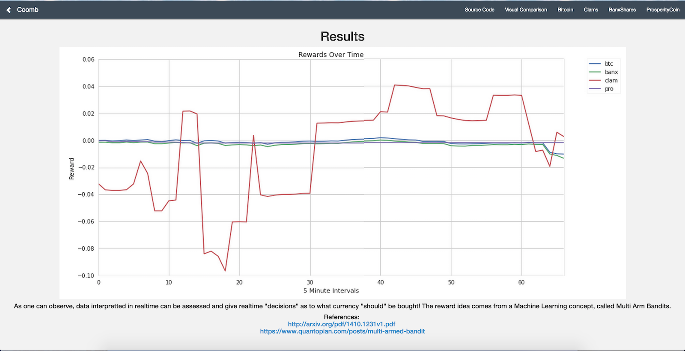

#Coomb

###Concept

I tried to programmatically buy and sell different cryptocurrencies using machine learning to make money from the fluctuating currency values. [This website](http://coinmarketcap.com/) does a good job of displaying the different cryptocurrencies and their prices over the last 7 days.

###How it works

Coomb uses the UCB1 Multi Arm Bandit Algorithm to process inputs of data and graph the potential of reward corresponding with each "arm" (option)!

Based on this work: https://www.quantopian.com/posts/multi-armed-bandit

Here were the results that I got from 9 hours of data aggregation:
